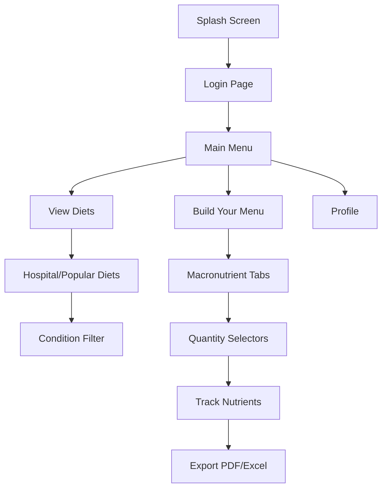

# Diet Explorer – Personalized Diet Management App

## 🎯 Project Overview

A comprehensive mobile and web application enabling users to explore clinical and popular diets, create personalized menus, track nutrients, and manage dietary preferences with a self-contained authentication system.

## 🧩 Core Features

### Diet Management
- **Diets Library**: Browse hospital and popular diets with condition-specific filters
- **Health Condition Filters**: Diabetic-friendly, cardiac-safe, renal-safe options
- **Custom Menu Builder**: Add, adjust, and track food items with calorie breakdown
- **Macronutrient Classification**: 
  - Fats (Saturated/Unsaturated)
  - Proteins (Animal/Plant)
  - Carbohydrates (Low/High GI)

### Measurement & Tracking
- **Unit Selector**: Flexible unit options (oz, ml, cups, etc.)
- **Serving Estimator**: Calorie and weight calculations based on user input
- **Nutrient Tracker**: Real-time tracking of macronutrients
- **Export Options**: Download plans as PDF or Excel

### Advanced Features
- **Camera Integration**: Food recognition via mobile camera (Clarifai/Nutritionix API)
- **User Authentication**: Local credential system without external dependencies

## 🔐 Authentication System

- Local user account creation with username/password
- Secure password hashing
- Data persistence using SQLite or flat-file database
- Optional Express + JSON backend implementation

## 💻 Technical Stack

### Frontend
- HTML/CSS/JavaScript
- Flutter/React Native (cross-platform support)

### Backend
- Node.js + Express or PHP
- Custom authentication system
- SQLite/JSON data storage

### APIs & Libraries
- HTML5 Media API/Mobile Camera API
- jsPDF (PDF export)
- SheetJS (Excel export)
- Clarifai/Nutritionix (food recognition)

## 📱 Platform Support

- Android (API 24+)
- iOS (iOS 13+)

## 🔄 Application Flow



## ✅ Key Functionalities

### Diet Exploration
- Hospital Diets Tab (Clinical diets)
- Popular Diets Tab (Keto, Paleo, Mediterranean, Vegan)
- Condition-specific filtering

### Menu Creation
- Interactive menu builder
- Flexible unit selection
- Real-time calorie calculation
- Nutrient tracking
- Serving size estimation

### User Features
- Profile management
- Menu history
- Export capabilities
- Camera-based food recognition

## 🎨 Design Philosophy

- Clean, intuitive interface
- Cross-platform consistency
- Responsive design
- Accessibility considerations
- Modern UI/UX principles

## 🌈 Advanced UI Features

### Theme System
- **Multiple Theme Options**:
  - Light Mode
  - Dark Mode
  - High Contrast Mode
  - Custom Theme Builder
- **Dynamic Color Schemes**:
  - Material Design 3
  - iOS Design System
  - Custom Brand Colors
- **Accessibility Features**:
  - Font Size Scaling
  - Color Blindness Support
  - Screen Reader Optimization

### Internationalization
- **Language Support**:
  - English (Default)
  - Spanish
  - French
  - German
  - Chinese
  - Arabic (RTL Support)
- **Regional Adaptations**:
  - Date/Time Formats
  - Measurement Units
  - Currency Formats
  - Cultural Preferences

### UI Components

#### Navigation
- Bottom Navigation Bar
- Drawer Menu
- Tab Navigation
- Search Bar with Filters
- Back Navigation

#### Data Display
- Custom Charts and Graphs
- Progress Indicators
- Animated Transitions
- Skeleton Loading States
- Pull-to-Refresh

#### Input Controls
- Custom Text Fields
- Date/Time Pickers
- Sliders and Range Selectors
- Checkboxes and Radio Buttons
- Dropdown Menus

#### Feedback Elements
- Toast Messages
- Snackbars
- Loading Spinners
- Success/Error States
- Confirmation Dialogs

## 🛠️ Function Implementation Details

### Authentication Functions
```typescript
interface User {
  id: string;
  username: string;
  email: string;
  preferences: UserPreferences;
}

interface UserPreferences {
  theme: 'light' | 'dark' | 'high-contrast';
  language: string;
  units: 'metric' | 'imperial';
  notifications: boolean;
}

function authenticateUser(credentials: Credentials): Promise<User>;
function updateUserPreferences(userId: string, preferences: Partial<UserPreferences>): Promise<void>;
function resetPassword(email: string): Promise<void>;
```

### Diet Management Functions
```typescript
interface Diet {
  id: string;
  name: string;
  type: 'hospital' | 'popular';
  restrictions: string[];
  macronutrientTargets: MacronutrientTargets;
}

interface MenuItem {
  id: string;
  name: string;
  quantity: number;
  unit: string;
  calories: number;
  macronutrients: Macronutrients;
}

function createCustomDiet(dietData: Partial<Diet>): Promise<Diet>;
function addMenuItem(menuId: string, item: MenuItem): Promise<void>;
function calculateNutritionTotals(menuItems: MenuItem[]): NutritionSummary;
function exportMenu(menuId: string, format: 'pdf' | 'excel'): Promise<Blob>;
```

### Camera Integration Functions
```typescript
interface FoodRecognitionResult {
  name: string;
  confidence: number;
  nutritionInfo: NutritionInfo;
  alternatives: FoodItem[];
}

function captureFoodImage(): Promise<Blob>;
function analyzeFoodImage(image: Blob): Promise<FoodRecognitionResult>;
function saveFoodToHistory(result: FoodRecognitionResult): Promise<void>;
```

### Data Persistence Functions
```typescript
interface Database {
  users: Collection<User>;
  diets: Collection<Diet>;
  menus: Collection<Menu>;
  foodHistory: Collection<FoodHistory>;
}

function initializeDatabase(): Promise<Database>;
function syncData(): Promise<void>;
function backupUserData(userId: string): Promise<void>;
```

### Theme Management Functions
```typescript
interface Theme {
  primary: string;
  secondary: string;
  background: string;
  text: string;
  accent: string;
}

function setTheme(theme: Theme): void;
function toggleDarkMode(): void;
function generateCustomTheme(colors: Partial<Theme>): Theme;
```

### Language Management Functions
```typescript
interface Translation {
  key: string;
  value: string;
  language: string;
}

function setLanguage(language: string): void;
function translate(key: string): string;
function loadTranslations(language: string): Promise<Translation[]>;
```

## 📱 Platform-Specific Implementations

### iOS
- SwiftUI Components
- iOS Design Guidelines
- Push Notifications
- HealthKit Integration
- iCloud Sync

### Android
- Material Design Components
- Android Design Guidelines
- Firebase Cloud Messaging
- Google Fit Integration
- Google Drive Backup

### Web
- Progressive Web App (PWA)
- Responsive Design
- Service Workers
- Local Storage
- IndexedDB

## 🔒 Security Implementation

### Data Protection
- End-to-end encryption
- Secure storage
- API authentication
- Session management
- Rate limiting

### Privacy Features
- Data anonymization
- Privacy settings
- Data export/delete
- Cookie management
- Location services

## 📊 Analytics & Monitoring

### Performance Metrics
- Load times
- Response times
- Error rates
- User engagement
- Feature usage

### Error Tracking
- Crash reporting
- Error logging
- User feedback
- Bug tracking
- Performance monitoring
